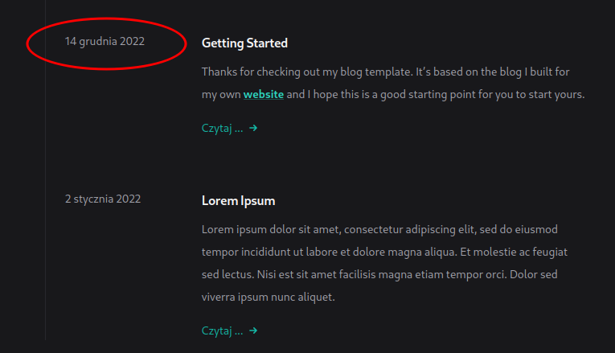

## Data po polsku

Chciałem mieć ładnie brzmiącą datę.

Kiedy wyświetlałem zestawienie wpisów i pokazywały się ich daty to chciałem żeby były one po polsku. Czyli pokazywało 15 grudnia czy 14 marca. W wersji orginalnej było oczywiści po angielsku.


Kod do tego wyglądał mniej więcej tak.

```js
{format(new Date(parseISO(post.date)), 'MMMM d,yyyy'}

```

## Mówimy po polski tak?

Ja za to chciałem, żeby Dec zmienił się w grudzień. W domentacji **date-fns** w funkcji **format** znalazłem odniesienie do opcji locale.

Myśle sobie super hurra. I jedziemy z tym.

Poprzedni kod zmieniłem na

```js
{format(new Date(parseISO(post.date)), 'd MMMM yyyy', {locale: pl})}
```

I jakieś było moje zdumenie kiedy SvelteKit wywalił mi błąd.
Myślę, sobie tutaj tylko google może pomóc.

Dawaj bład w google i co wyskoczyło? Okazuje się, że jeszcze musiałem importować odpowiedni język do aplikacji.

Czyli mój kod wyglądał mniej więcej tak.

```js
import { format, parseISO } from 'date-fns'
import pl from 'date-fns/locale'
...
{format(new Date(parseISO(post.date)), 'd MMMM yyyy', {locale: pl})}
```

Odpalam **npm run dev** i co widzę, że wszystko super śmiga.



Myślę, sobie no to super. Sprawa załatwiona daty mamy po polsku.

## Wszyskto dobrze napewno ?

No to teraz szybciutki deply na Vercel i co? Wywala błąd. Nie działa.

Myślę sobie no to ładnie, ale gdzie i jak. Przy zbudowaniu aplikacji na mojej maszynie żadnych błędów nie było.

Dobra to long story short, bo się z tym mocowałem naprwdę dłuższą chwilę.

Okazuję się, że poprzedni kod owszem dział w wersji **dev** ale przy wysłaniu na produkcjię trzeba jednak jeszcze trochę go zmienić. Rozwiązanie znalazłem na GitHubie w dyskucji właśnie o tym błędzie.

Poprawny kod wygląda tak:

```js
import { format, parseISO } from 'date-fns'
import pl from 'date-fns/locale/pl/index'
...
{format(new Date(parseISO(post.date)), 'd MMMM yyyy', {locale: pl})}

```

Tyle i aż tyle

```js
import pl from 'date-fns/locale/pl/index'
```

Ta końcówka **/pl/index** zmieniła wszyskto. Od teraz wszsytko chula jak możecie zobaczyć sami.

